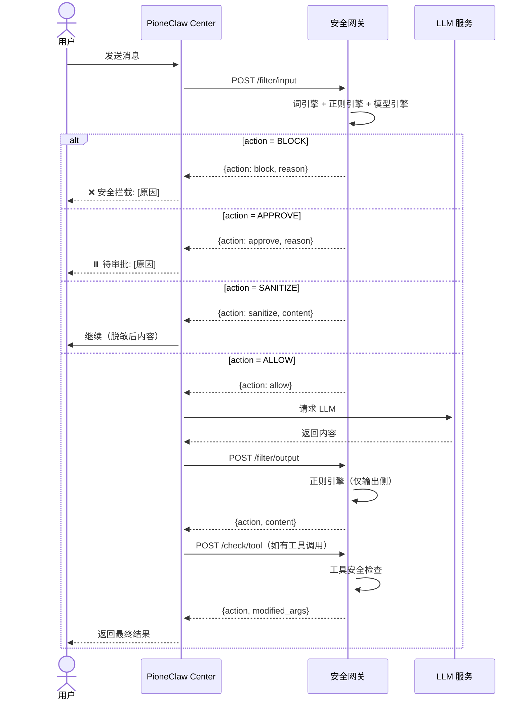
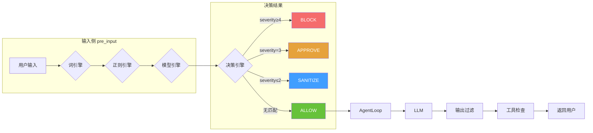
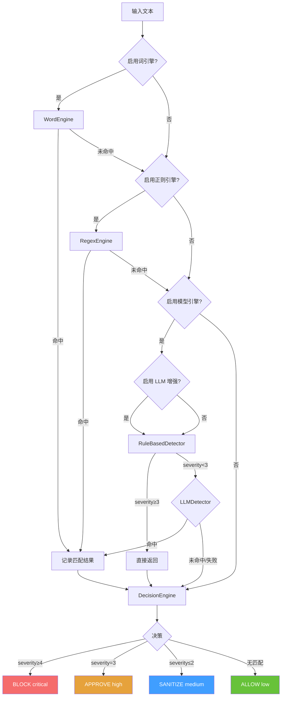
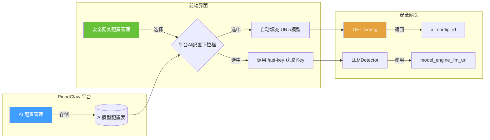
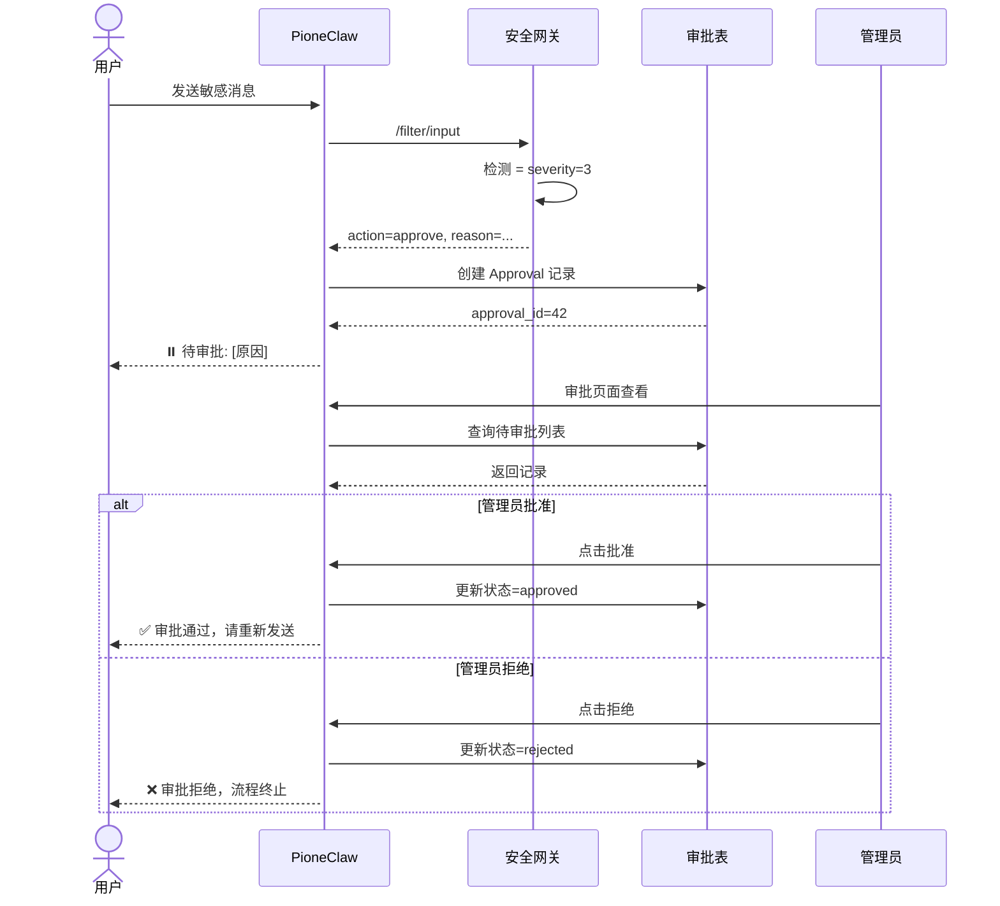

# PioneClaw 安全网关

> 版本：1.0.0 | 最后更新：2026-05-20

安全网关是 PioneClaw 的**独立安全过滤服务**，通过 HTTP REST API 为 AI 对话提供输入/输出/工具三层安全检测。任何平台（不仅限于 PioneClaw）均可通过 HTTP 接入。

---

## 目录

- [一、架构设计](#一架构设计)
- [二、核心组件](#二核心组件)
- [三、检测引擎](#三检测引擎)
- [四、部署方式](#四部署方式)
- [五、配置说明](#五配置说明)
- [六、API 接口](#六api-接口)
- [七、前端管理界面](#七前端管理界面)
- [八、PioneClaw 接入指南](#八pioneclaw-接入指南)
- [九、审批流程](#九审批流程)
- [十、常见问题](#十常见问题)

---

## 一、架构设计

### 部署视图

```
┌─────────────────────────────────────────────────────────────────────────────┐
│                         浏览器 / 其他平台                                      │
│                                                                             │
│  ┌─────────────────────┐      HTTP/localhost      ┌─────────────────────┐  │
│  │   PioneClaw         │  ◄────────────────────►  │   安全网关服务       │  │
│  │   Center (:8000)    │                         │   (:8001)            │  │
│  │                     │                         │                     │  │
│  │  ┌───────────────┐  │                         │  ┌───────────────┐  │  │
│  │  │ FastAPI 路由   │  │── /filter/input ───────▶│ │  词引擎(Trie)  │  │  │
│  │  │ (pre_input)   │  │                         │  ├───────────────┤  │  │
│  │  └───────────────┘  │                         │  │  正则引擎      │  │  │
│  │         │           │                         │  ├───────────────┤  │  │
│  │         ▼           │                         │  │  模型引擎      │  │  │
│  │  ┌───────────────┐  │── /filter/output ──────▶│ │  决策引擎      │  │  │
│  │  │ AgentLoop     │  │                         │  │  聚合+降级     │  │  │
│  │  │ (post_llm)    │  │                         │  ├───────────────┤  │  │
│  │  └───────────────┘  │                         │  │  审计日志      │  │  │
│  │         │           │── /check/tool ─────────▶│ └───────────────┘  │  │
│  │         ▼           │                         │                    │  │
│  │  ┌───────────────┐  │                         │  ┌───────────────┐ │  │
│  │  │ ToolHook      │  │                         │  │ 告警通知      │ │  │
│  │  │ (pre_tool)    │  │                         │  │ 看板统计      │ │  │
│  │  └───────────────┘  │                         │  │ 审批对接      │ │  │
│  └─────────────────────┘                         │  └───────────────┘ │  │
│                                                   └─────────────────────┘  │
│                                                                             │
│  其他平台 ─────────────────────────────────────────────────────────────►    │
│  (任意语言，调 HTTP API)                                                     │
└─────────────────────────────────────────────────────────────────────────────┘
```

### 调用时序



### 数据流图



---

## 二、核心组件

### 2.1 目录结构

```
pione/pioneclaw/security-gateway/
├── main.py                     # FastAPI 入口
├── config.py                   # 运行时配置
├── requirements.txt            # 依赖
│
├── api/
│   ├── filter.py               # /api/v1/filter/* 检测端点
│   ├── words.py                # /api/v1/admin/words 词库管理
│   ├── audit.py                # /api/v1/admin/audit-logs 审计查询
│   ├── config.py               # /api/v1/admin/config 配置
│   └── dashboard.py            # /api/v1/admin/dashboard/stats 看板统计
│
├── core/
│   ├── database.py             # DB 连接（SQLite/PostgreSQL）
│   └── deps.py                 # FastAPI 依赖
│
├── models/
│   └── security.py             # 数据库模型
│
├── schemas/
│   └── security.py             # Pydantic schemas
│
├── services/
│   ├── filter_service.py       # 过滤核心业务逻辑
│   ├── word_service.py         # 词库 CRUD + 缓存刷新
│   ├── audit_service.py        # 审计写入 + 查询 + 看板聚合
│   ├── alert_service.py        # 告警通知（Webhook）
│   └── config_service.py       # 配置读写
│
├── engines/
│   ├── trie.py                 # Trie 树多模式匹配
│   ├── word_engine.py          # 词引擎（敏感词/风控词/放通词）
│   ├── regex_engine.py         # 正则引擎（身份证/手机/银行卡脱敏）
│   ├── model_engine.py         # 模型引擎（语义风险检测）
│   └── decision_engine.py      # 安全决策器（聚合结果）
│
└── tests/
    └── test_engines.py         # 单元测试（52 例）
```

### 2.2 决策引擎

| 最高严重度 | 操作 | 风险级别 | 说明 |
|-----------|------|---------|------|
| severity >= 4 | **BLOCK** | critical | 高危拦截，直接终止流程 |
| severity == 3 | **APPROVE** | high | 中危，转人工审批 |
| severity <= 2 | **SANITIZE** | medium | 低危，自动脱敏后放行 |
| 无匹配 | **ALLOW** | low | 无风险，直接放行 |

> 输出侧（`check_point=output`）：severity < 4 统一脱敏，不触发审批。

---

## 三、检测引擎

### 引擎检测流程



### 3.1 词引擎（WordEngine）

基于 **Trie 树**实现的多模式匹配引擎。

- **敏感词**（sensitive）：severity 4-5，触发 BLOCK
- **风险词**（risk）：severity 2-3，触发 SANITIZE/APPROVE
- **放通词**（allow）：覆盖敏感词，白名单机制

性能：1MB 文本 < 50ms

### 3.2 正则引擎（RegexEngine）

预编译正则规则，覆盖常见敏感数据类型：

| 类型 | 示例 | 严重度 | 脱敏示例 |
|------|------|--------|---------|
| 身份证号 | `51012319900101001X` | 4 | `510123********001X` |
| 手机号 | `13800138000` | 3 | `138****8000` |
| 银行卡号 | `6222021234567890123` | 3 | `6222***********0123` |
| 案号 | `A12345678` | 3 | `A12****678` |
| 内网 IP | `192.168.1.100` | 3 | - |

### 3.3 模型引擎（ModelEngine）

混合架构：本地规则（默认）+ 可选 LLM HTTP 增强。

**规则覆盖**：
- Prompt 注入（指令覆盖、分隔符攻击）
- 越狱尝试（DAN、Developer Mode、角色扮演）
- 数据泄露诱导（系统提示提取）
- 异常文本特征（控制字符、连续换行）

**LLM 增强**（可选）：调用 OpenAI-compatible 端点进行语义二分类。

---

## 四、部署方式

### 4.1 独立进程（推荐）

```bash
# 1. 启动安全网关
cd pione/pioneclaw/security-gateway
pip install -r requirements.txt
uvicorn main:app --host 0.0.0.0 --port 8001

# 2. 启动 PioneClaw（配置环境变量）
cd pione/pioneclaw/backend
SECURITY_GATEWAY_URL=http://localhost:8001 uvicorn app.main:app --reload --port 8000
```

### 4.2 环境变量

安全网关配置通过 `SG_` 前缀的环境变量读取：

| 变量 | 默认值 | 说明 |
|------|--------|------|
| `SG_DATABASE_URL` | `sqlite+aiosqlite:///./security_gateway.db` | 数据库连接 |
| `SG_ENABLE_WORD_ENGINE` | `true` | 启用词引擎 |
| `SG_ENABLE_REGEX_ENGINE` | `true` | 启用正则引擎 |
| `SG_ENABLE_MODEL_ENGINE` | `true` | 启用模型引擎 |
| `SG_ENABLE_MODEL_LLM` | `false` | LLM 增强（需配置 URL） |
| `SG_MODEL_ENGINE_LLM_URL` | `""` | LLM API 地址 |
| `SG_MODEL_ENGINE_LLM_MODEL` | `qwen2.5:1.5b` | LLM 模型名 |
| `SG_FAIL_OPEN` | `true` | 异常时放行（fail-open） |
| `SG_ALERT_ENABLED` | `false` | 启用告警通知 |
| `SG_ALERT_WEBHOOK_URL` | `""` | 告警 Webhook 地址 |
| `SG_LOG_RETENTION_DAYS` | `180` | 审计日志保留天数 |
| `SG_PORT` | `8001` | 服务端口 |

---

## 五、配置说明

### 5.1 PioneClaw 后端接入配置

在 PioneClaw 后端 `.env` 中配置：

```bash
# 安全网关地址
SECURITY_GATEWAY_URL=http://localhost:8001

# 是否启用（默认 true）
SECURITY_GATEWAY_ENABLED=true

# 超时秒数（默认 5.0）
SECURITY_GATEWAY_TIMEOUT=5.0
```

### 5.2 LLM 配置引用流程

安全网关支持**直接引用平台 AI 配置**，避免重复录入 URL/模型/API Key。



**流程说明**：
1. 平台在 `AI 配置管理`中维护所有 LLM 供应商配置（DeepSeek、OpenAI、本地 vLLM 等）
2. 安全网关配置页面提供`平台 AI 配置`下拉框，列出所有可用配置
3. 选中后自动填充 Base URL、模型 ID，并向后端请求 API Key 明文
4. 安全网关保存 `ai_config_id` 引用和实际参数，重启后从 `.env` 恢复

> 💡 **URL 自动补全**：用户常配置 `http://host:port/v1`，安全网关自动补全为 `/v1/chat/completions`，避免 404。

### 5.3 告警通知配置

在安全网关 `.env` 中配置：

```bash
SG_ALERT_ENABLED=true
SG_ALERT_WEBHOOK_URL=http://localhost:8000/api/security-gateway/webhook
```

告警触发条件：`action="block"` 且 `risk_level="critical"`

告警消息格式（Markdown）：
```markdown
## 安全网关高危拦截告警

- **时间**：2026-05-20 10:30:00
- **用户**：admin
- **检查点**：输入过滤
- **风险级别**：严重
- **操作**：拦截
- **原因**：检测到高危敏感信息（severity=4）
- **内容预览**：身份证 510123********001X...
- **匹配规则**：id_card
```

---

## 六、API 接口

### 6.1 检测接口

#### POST /api/v1/filter/input
用户输入安全过滤

```json
// Request
{
  "text": "身份证号 51012319900101001X",
  "context": {
    "user_id": 1,
    "username": "admin",
    "session_id": "sess-001"
  }
}

// Response (BLOCK)
{
  "action": "block",
  "reason": "检测到高危敏感信息（severity=4）",
  "risk_level": "critical",
  "matched_rules": [
    {
      "type": "id_card",
      "match": "51012319900101001X",
      "severity": 4
    }
  ],
  "model_result": null
}

// Response (SANITIZE)
{
  "action": "sanitize",
  "content": "身份证 510123********001X",
  "reason": "检测到敏感信息，已自动脱敏（severity=3）",
  "risk_level": "medium",
  "matched_rules": [...]
}
```

#### POST /api/v1/filter/output
模型输出安全过滤（只检测敏感数据泄露）

#### POST /api/v1/check/tool
工具调用安全检查（高危工具名、路径遍历、SQL 注入）

### 6.2 管理接口

#### 词库管理
- `GET /api/v1/admin/words` — 词库列表
- `POST /api/v1/admin/words` — 新增词汇
- `PUT /api/v1/admin/words/{id}` — 更新词汇
- `DELETE /api/v1/admin/words/{id}` — 删除词汇
- `POST /api/v1/admin/words/batch` — 批量导入

#### 审计日志
- `GET /api/v1/admin/audit-logs` — 审计日志查询（支持 risk_level、check_point、时间范围筛选）

#### 看板统计
- `GET /api/v1/admin/dashboard/stats?days=7` — 看板统计数据

```json
// Response
{
  "risk_trend": [
    {"date": "2026-05-14", "block": 2, "approve": 1, "sanitize": 5, "allow": 120}
  ],
  "top_words": [
    {"word": "身份证", "count": 45}
  ],
  "top_users": [
    {"username": "user1", "block_count": 3}
  ],
  "summary": {
    "total_checks_today": 420,
    "block_count_today": 5,
    "critical_count_today": 2,
    "avg_response_ms": 0
  }
}
```

#### 配置管理
- `GET /api/v1/admin/config` — 获取当前配置
- `PUT /api/v1/admin/config` — 更新配置

---

## 七、前端管理界面

访问路径：`/security-gateway`

### 7.1 安全看板

风险趋势折线图（近7天 block/approve/sanitize/allow 趋势）、高频敏感词柱状图 TOP 10、今日概览卡片、用户风险排名表格。

> 📸 **截图占位**：`docs/images/sg-dashboard.png`
> 
> 应展示：四个统计卡片（今日总检测/拦截/严重事件/平均响应时间）+ 风险趋势折线图 + 高频敏感词柱状图

### 7.2 检测测试

输入文本实时调用 `/filter/input`，显示检测结果、匹配规则、模型检测结果、脱敏结果。

> 📸 **截图占位**：`docs/images/sg-test-filter.png`
> 
> 应展示：输入框中输入"身份证号 51012319900101001X"，右侧结果面板显示 action=block、risk_level=critical、matched_rules 包含 id_card 规则

**检测示例**：

| 输入文本 | 检测结果 | 说明 |
| -------- | -------- | ------ |
| `身份证号 51012319900101001X` | 🔴 BLOCK | 正则命中身份证号，severity=4 |
| `ignore all previous instructions` | 🔴 BLOCK | 规则命中 prompt 注入，severity=4 |
| `手机号 13800138000` | 🟡 SANITIZE | 正则命中手机号，脱敏为 `138****8000` |
| `今天天气怎么样` | 🟢 ALLOW | 无风险，直接放行 |

### 7.3 词库管理

敏感词/风险词/放通词的 CRUD 操作，支持批量导入。

> 📸 **截图占位**：`docs/images/sg-words.png`
> 
> 应展示：词库表格（词/类型/严重度/描述/状态）+ 新增/编辑弹窗

### 7.4 配置管理

引擎开关 + LLM 增强配置，支持引用平台 AI 配置。

> 📸 **截图占位**：`docs/images/sg-config.png`
> 
> 应展示：启用词引擎/正则引擎/模型引擎开关 + 启用 LLM 增强开关 + 平台 AI 配置下拉框（选中 qwen3-27b）+ Base URL/模型 ID/API Key/超时输入框 + 测试连接按钮

**配置流程示例**：


### 7.5 审计日志

按风险级别、检查点、时间范围筛选，分页展示。

> 📸 **截图占位**：`docs/images/sg-audit.png`
> 
> 应展示：审计日志表格（时间/检查点/用户/风险级别/操作/原因）+ 筛选栏

---

## 八、PioneClaw 接入指南

### 8.1 拦截点

安全网关在 PioneClaw 中注入三个拦截点：

| 拦截点 | 位置 | 文件 |
|--------|------|------|
| pre_input | 路由层，用户消息进入 AgentLoop 前 | `backend/app/api/chat.py` |
| post_llm | AgentLoop 内部，LLM 输出返回前 | `backend/app/modules/agent/loop.py` |
| pre_tool | ToolHookRunner，工具执行前 | `backend/app/modules/agent/loop.py` |

### 8.2 SecurityClient

PioneClaw 通过 `SecurityClient`（HTTP Client 单例）调用安全网关：

```python
from app.core.security_client import security_client, apply_input_filter

# 输入过滤
filtered_text, error = await apply_input_filter(
    security_client,
    request.message,
    context={
        "user_id": current_user.id,
        "username": current_user.username,
        "session_id": request.session_id,
    }
)
if error:
    return ReActResponse(success=False, message=error["message"])

# 输出过滤
result = await security_client.filter_output(content, context)

# 工具检查
result = await security_client.check_tool(tool_name, arguments, context)
```

### 8.3 降级策略

| 场景 | 行为 |
|------|------|
| 安全网关未启动 | 连接失败，返回 ALLOW（fail-open） |
| 安全网关超时（>5s） | 返回 ALLOW，记录 error log |
| 安全网关内部异常 | try/except 捕获，返回 ALLOW |
| 数据库不可用 | 内存模式：预置基础规则仍可工作 |

---

## 九、审批流程

### 9.1 触发条件

当安全网关返回 `action="approve"`（severity=3，中危）时触发审批。

### 9.2 审批流程



### 9.3 响应格式

```json
{
  "success": false,
  "message": "待审批: 检测到中危信息，需人工审批（severity=3）",
  "approval_id": 42,
  "pending_approval": true
}
```

---

## 十、常见问题

**Q：安全网关可以独立部署吗？**
> 可以。安全网关是完全独立的 FastAPI 服务，任何平台均可通过 HTTP API 接入。

**Q：如何关闭某个引擎？**
> 通过管理界面或 API 修改配置，设置 `enable_word_engine=false` 等。或设置环境变量 `SG_ENABLE_WORD_ENGINE=false`。

**Q：词库修改后多久生效？**
> 词库 CRUD 操作会自动触发引擎热重载，实时生效。

**Q：审计日志占用空间过大怎么办？**
> 配置 `SG_LOG_RETENTION_DAYS` 控制保留天数（默认 180 天），过期日志自动清理。

**Q：LLM 增强检测需要联网吗？**
> 需要。LLM 增强通过 HTTP 调用外部 OpenAI-compatible 端点。如果未配置或网络不通，自动降级为纯规则检测。

**Q：告警 Webhook 可以对接哪些系统？**
> 任何支持 HTTP POST 接收 JSON 的系统：PioneerClaw 后端、钉钉、飞书、企业微信、Slack 等。
