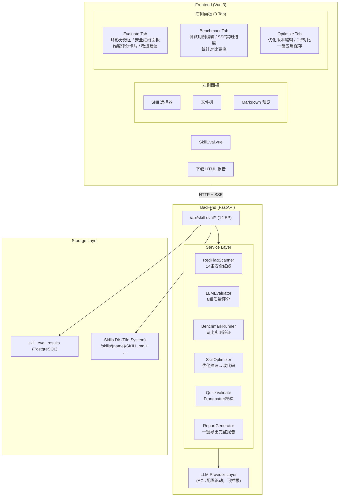
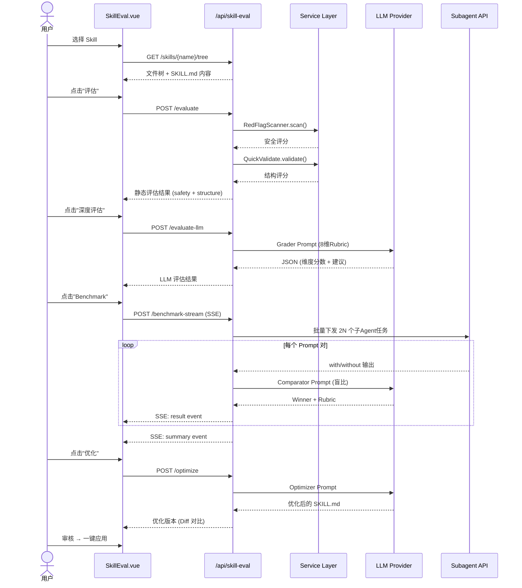
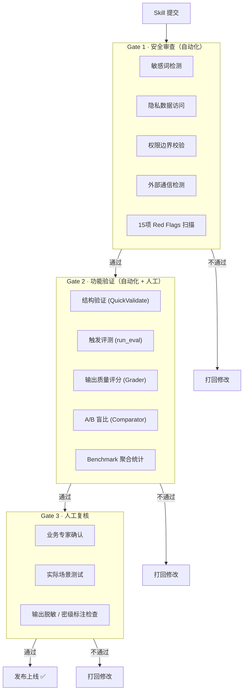
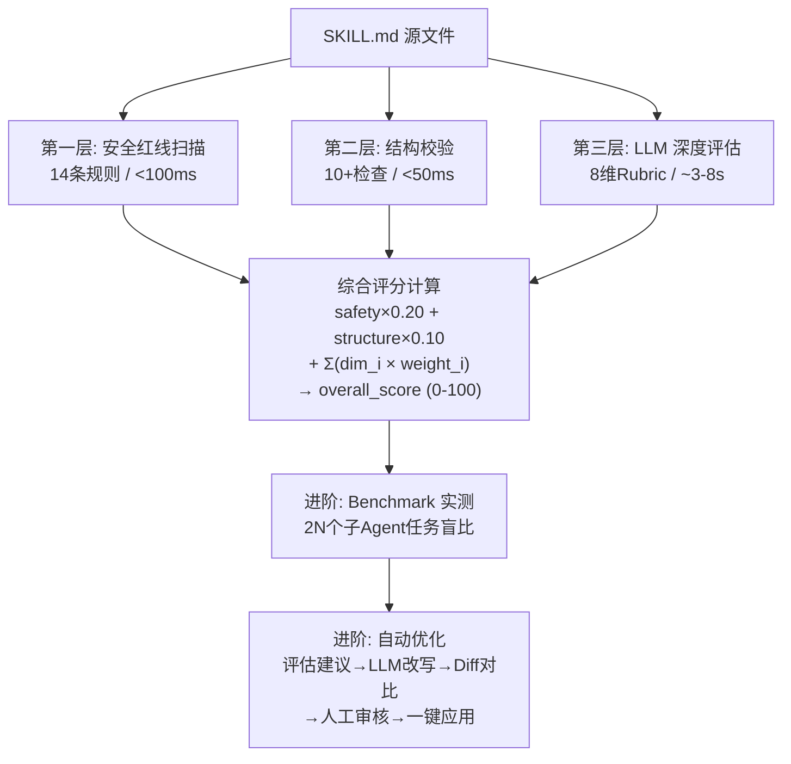
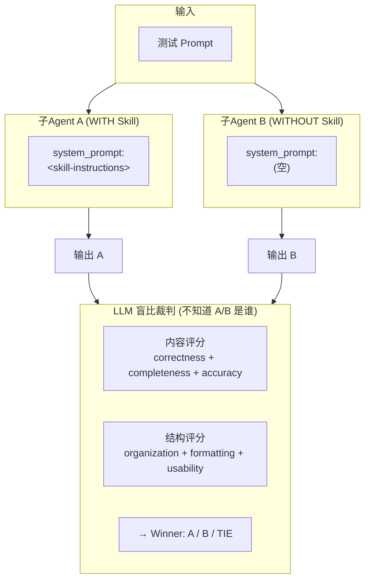
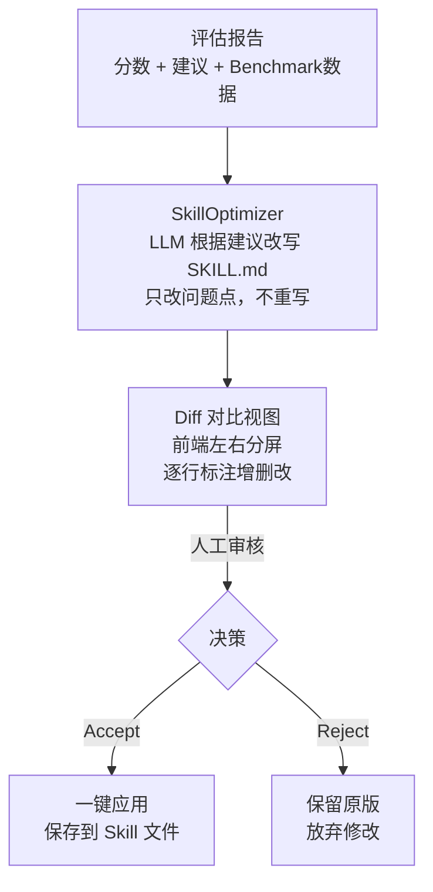
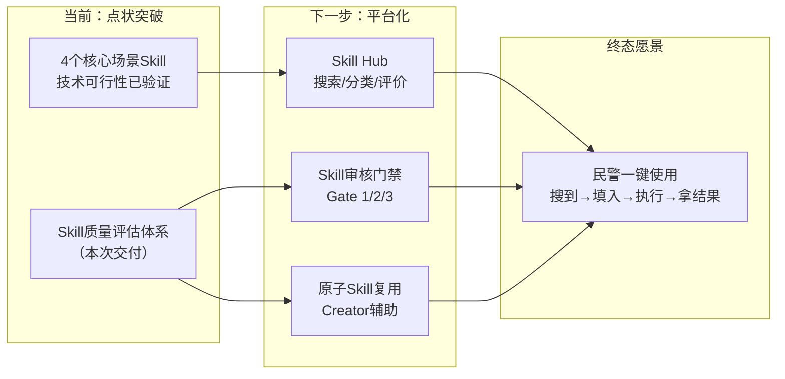

# 为每一个 Skill 装上"安检门"：企业级 AI Skill 质量评估体系实践

> 作者：PioneClaw 项目组 | 2026-05-28

---

## 一、我们解决什么问题

PioneClaw 作为 AI Agent 平台，核心能力之一是通过 **Skill（技能文件）** 定义 Agent 的行为模式。一个 Skill 本质上是一份 Markdown 文件 + 配套脚本/资源，它告诉 AI："你是谁、什么时候被激活、该怎么做"。

随着平台上的 Skill 数量快速增长，一个痛点逐渐暴露：**Skill 的质量完全依赖编写者的个人经验和自觉**。

具体表现为四个问题：

| 问题 | 表现 | 影响 |
|------|------|------|
| **质量不可见** | 没有客观评分，好 Skill 和差 Skill 混在一起 | 用户踩坑率高，平台口碑受损 |
| **安全无保障** | Skill 可能包含 `rm -rf`、curl-pipe-shell、硬编码凭证 | 安全事件风险 |
| **改进无方向** | 编写者不知道"改哪里、怎么改" | 迭代全靠猜，效率低下 |
| **效果无法验证** | 装上 Skill 后，Agent 输出真的变好了吗？ | 投入产出不透明 |

我们需要的不是一个"代码审查工具"，而是一套**面向 AI Agent Skill 这个新物种的完整质量工程体系**。

---

## 二、总体架构

### 2.1 全栈分层架构



### 2.2 页面交互流程



---

## 三、顶层设计：三 Gate 审核门禁体系

在深入技术细节之前，先回答一个更根本的问题：**Skill 质量评估在整个平台中的定位是什么？**

答案是：它是 Skill 平台化建设六大支柱中 **"可信"支柱** 的核心基础设施。一个 Skill 从提交到上线，必须经过三道质量关口——这就是规划中的三 Gate 审核门禁。

### 3.1 远期目标：三 Gate 全流程

参考业界 Skill Vetter 协议及公安行业的安全合规要求，远期审核体系设计为三级门禁：



### 3.2 当前进展：我们实现了什么

我们的 skill-eval 是对这套门禁体系的**技术落地**。来看已有成果和三 Gate 的对应关系：

```
三 Gate 体系                  我们的 skill-eval 当前实现          进度
──────────────────────────────────────────────────────────────────
Gate 1: 安全审查              ✅ 14条 Red Flag 规则扫描           ████████ 100%
                              ✅ 敏感路径/凭证/提权检测
                              ✅ 注释行智能跳过+去重
                              ─────────────────────────────────
Gate 2: 功能验证              ✅ QuickValidate 结构校验            ██████░░  80%
                              ✅ LLM Grader 8维质量评分
                              ✅ Benchmark 盲比实测
                              ✅ Comparator A/B 输出对比
                              ⬜ run_eval 触发评测(待适配)
                              ─────────────────────────────────
Gate 3: 人工复核              ⬜ 审核结果可视化（已设计）           ██░░░░░░  20%
                              ⬜ 业务专家确认 SOP（待协同）
```

**结论：Gate 1 全覆盖，Gate 2 覆盖八成，Gate 3 已设计待落地。**

### 3.3 评测流水线的 10 个组件

参照 skill-creator Eval Framework 行业标准，完整的评测体系由 10 个组件构成。以下是各组件的职责及我们的实现状态：

| # | 组件 | 功能 | 我们的实现 | 状态 |
|---|------|------|-----------|------|
| 1 | quick_validate | SKILL.md 存在性、frontmatter YAML 格式、命名规范、description 等结构检查 | `QuickValidate` | ✅ |
| 2 | run_eval | 构造正/负向触发查询，并发测试 Skill 是否被正确触发 | — 待 Windows 适配 | ⬜ |
| 3 | grader | 定义 Expectations，对照执行输出逐条 PASS/FAIL，附证据引用 | `LLMEvaluator` (8维 Rubric) | ✅ |
| 4 | comparator | A/B 盲比：按内容+结构双维度打分，不知来源地比较输出质量 | `BenchmarkRunner` (盲比 Comparator) | ✅ |
| 5 | analyzer | 基于盲比结果分析胜败原因，提取改进建议 | `SkillOptimizer` | ✅ |
| 6 | run_loop | 自动化"评测→发现问题→调优→再评测"闭环 | 优化闭环已打通 | ✅ |
| 7 | improve_description | 基于触发评测失败结果，自动生成修正后的 description | — 待实现 | ⬜ |
| 8 | aggregate_benchmark | with/without skill 多轮运行的聚合统计 | `BenchmarkAggregator` + stats | ✅ |
| 9 | generate_report | 自包含 HTML 报告生成 | `ReportGenerator` | ✅ |
| 10 | eval-viewer | 交互式审查页面 | `SkillEval.vue` | ✅ |

**10 个组件已完成 8 个（80%）**。以下章节将逐一展开"我们是怎么实现的"。

---

## 四、评估体系：三层纵深评估模型

在第二章的时序图中可以看到，一次完整的评估走两条路径：**快速静态评估**（安全扫描 + 结构校验，亚秒级）和**LLM 深度评估**（8 维 Rubric，秒级）。它们构成了三层纵深评估模型：



### 4.1 第一层：安全红线扫描（14 条规则，静态分析）

这是评估体系的**第一道关口**。我们参考了 OWASP 的威胁建模思路，针对 AI Agent Skill 这个特殊载体，定义了 14 条安全红线：

| 规则ID | 严重级别 | 检测内容 | 典型攻击场景 |
|--------|---------|---------|-------------|
| RF01 | CRITICAL | curl/wget 管道到 shell | 供应链 RCE |
| RF02 | HIGH | 向外部服务器 POST/PUT 数据 | 数据外泄 |
| RF03 | CRITICAL | 硬编码凭证/Token/API Key | 凭证泄露 |
| RF04 | CRITICAL | 读取敏感系统路径 (~/.ssh, /etc/shadow) | 权限提升 |
| RF05 | CRITICAL | 读取 Agent 身份/记忆文件 | 身份窃取 |
| RF06 | CRITICAL | Base64 编解码操作 | 载荷混淆 |
| RF07 | CRITICAL | 动态代码执行 (eval/exec/system) | 任意代码执行 |
| RF08 | CRITICAL | 提权操作 (sudo/chmod 777) | 权限提升 |
| RF09 | HIGH | 安装未声明的第三方包 | 供应链投毒 |
| RF10 | HIGH | IP 地址直连（绕过 DNS） | C2 通信 |
| RF11 | CRITICAL | 混淆/编码混淆代码 | 规避审查 |
| RF12 | CRITICAL | 提取浏览器 Cookie/Session | 会话劫持 |
| RF13 | CRITICAL | 引用凭证文件名 (id_rsa, credentials.json) | 凭证窃取 |
| RF14 | HIGH | 递归强制删除 (rm -rf, shutil.rmtree) | 数据破坏 |

**评分规则**：满分 100。每命中一条 HIGH 扣 15 分，命中任意 CRITICAL 直接归零。

关键设计决策：
- **注释行默认跳过**，避免误报（但 RF06 Base64 和 RF12 Cookie 即使出现在注释中也检查——攻击者可能用"伪注释"藏恶意代码）。
- **去重机制**：同一规则在同一文件中只报告一次，避免刷屏。
- **目录级扫描**：支持扫描整个 Skill 目录下的所有文本文件（自动跳过二进制、node_modules、.git 等）。

### 4.2 第二层：结构规范校验（13 项检查，满分 160）

这一层确保 Skill 的"骨架"正确。所有检查都是静态分析，无需 LLM 调用，亚秒级完成。

| # | 检查项 | 满分 | 检查内容 |
|---|--------|------|----------|
| 1 | **SKILL.md 存在** | 5 | 技能目录下是否包含 SKILL.md 文件 |
| 2 | **body ≤ 500 行** | 5 | 正文行数（不含空行）。≤500 满分，500-750 建议拆分，>750 必须拆分 |
| 3 | **name 规范** | 10 | 5 项子检查：存在且非空、kebab-case 格式（`^[a-z0-9][a-z0-9-]*$`）、≤64 字符、不含模糊词（helper/utils/tools 等）、不含保留词（anthropic/claude）。每项 2 分 |
| 4 | **description 存在且 ≤1024** | 10 | 必须存在且不超过 1024 字符 |
| 5 | **description 含 WHAT+WHEN** | 20 | 正则匹配动作动词（生成/分析/评估/搜索等中英文 40+ 词）和触发信号词（when/if/trigger/当…时等）。缺 WHAT 或 WHEN 分别扣分 |
| 6 | **有工作流步骤** | 15 | 检测编号步骤（`1. `、`第N步`、`Step N`）或 markdown checklist（`- [ ]`） |
| 7 | **有示例** | 15 | 检测代码块（\`\`\`）或示例标记（Input:/Output:/输入/输出/示例/Example） |
| 8 | **有负面路由** | 10 | 检测不适用场景声明（don't use/not for/避免使用/应改用等），防止 near-miss 误触发 |
| 9 | **无硬编码绝对路径** | 5 | 扫描 `C:\`、`\\host\`、`/home/`、`/usr/` 等绝对路径，排除 URL 和 API 路径 |
| 10 | **无时间敏感信息** | 5 | 检测版本锁定日期（as of January 2024）、过期版本号引用（pinned to version）、特定日期戳（2024-01-01） |
| 11 | **YAML frontmatter 格式** | 10 | `---` 包裹、键值对结构合法。文件通过 `_parse_skill_md()` 解析即通过 |
| 12 | **frontmatter 字段合规** | 5 | 仅允许 name/title/description/license/tags/always/compatibility/install/metadata/dependencies，包含未知字段扣分 |
| 13 | **compatibility 类型** | 5 | 可选字段。若填写则必须为字符串且 ≤500 字符。未填则跳过（得满分） |

> **实现细节**：所有 frontmatter 解析只在 `_parse_skill_md()` 中做一次，13 项检查直接复用解析结果（content / fm 字典 / body_text），不重复读文件。

### 4.3 第三层：LLM 深度评估（8 维度 Rubric，100 分制）

这是评估体系的核心——我们设计了一套**结构化 Prompt 工程**方案，让 LLM 作为评审专家逐维度打分。

**结构维度（60 分）—— 静态可评估：**

| # | 维度 | 权重 | 考核点 |
|---|------|------|--------|
| 1 | Frontmatter 质量 | 8 | name 规范、description 含触发词 |
| 2 | 工作流清晰度 | 15 | 步骤可执行、输入输出明确 |
| 3 | 边界条件覆盖 | 10 | 异常处理、Fallback 路径 |
| 4 | 检查点设计 | 7 | 关键决策前用户确认 |
| 5 | 指令具体性 | 15 | 无模糊表述、可直接执行 |
| 6 | 资源整合度 | 5 | 引用路径正确可达 |

**效果维度（40 分）—— 需模拟推演：**

| # | 维度 | 权重 | 考核点 |
|---|------|------|--------|
| 7 | 整体架构 | 15 | 结构层次、冗余度、信息密度 |
| 8 | 实测表现 | 25 | 模拟典型 Prompt 推演执行流程 |

**Prompt 工程的关键设计**：

1. **Substance-over-form 原则**：有序号 ≠ 步骤可执行，有代码块 ≠ 示例有效。Prompt 明令评审"质量"而非"有没有"。
2. **强制引用原文证据**：每个维度 score 必须附带 `evidence` 字段，从 SKILL.md 中直接摘录原文，杜绝 LLM "凭感觉打分"。
3. **建议可执行化**：每条建议必须包含 `category`、`severity`、`impact`。禁止"影响用户体验"这种空话——必须写"硬编码路径导致其他用户无法执行脚本"这种具体后果。
4. **JSON 解析鲁棒性**：LLM 输出不保证严格 JSON，我们实现了多层降级——Markdown 代码块剥离 → 花括号平衡扫描 → 正则兜底匹配。

### 4.4 综合评分公式

```
safety_score    = RedFlagScanner 输出 (0-100)
structure_score = _run_structure_checks 输出 (13项归一化到 0-100)
llm_score       = Σ(dim_i.score × dim_i.weight)  for i=1..5

overall_score = (safety × 0.20 + structure × 0.10 + llm × 0.55) / 0.85
```

安全 20% + 结构 10% + LLM 评估 55% = 85%。

---

## 五、Benchmark 实测：用数据说话

评估给了分数，但 **"这个 Skill 装上之后，Agent 的表现真的变好了吗？"** 才是终极问题。

我们的 Benchmark 模块采用**受控实验 + 盲比打分**的设计：



### 统计维度

| 指标 | With Skill | Without Skill | Delta |
|------|-----------|---------------|-------|
| 盲比胜率 (Pass Rate) | — | — | +X% |
| 断言通过率 | mean±σ | mean±σ | ±Δ |
| 执行耗时 (秒) | mean±σ | mean±σ | ±Δs |
| Token 消耗 | mean±σ | mean±σ | ±Δ |

### 技术实现要点

- **异步并发**：2N 个子 Agent 任务通过 `asyncio.gather` 一次性全部下发，避免串行等待。
- **SSE 实时流**：`/benchmark-stream` 端点通过 Server-Sent Events 向前端推送进度，用户无需等待全部完成即可看到逐条结果。
- **断言 + 盲比双轨**：关键词断言快速给通过/不通过，LLM 盲比给出质量判断，两条轨道互相印证。

---

## 六、自动优化闭环

评估的最终目的是**改进**。我们实现了 `评估 → 建议 → 改写 → 对比 → 应用` 的完整闭环：



优化器的核心约束（通过 System Prompt 强制执行）：
- **只改问题点，不重写整个 Skill**：避免"优化"变成"重写"。
- **保持代码块完整性**：如果原 Skill 包含 Python/Shell 脚本，只改 Security/Correctness 问题。
- **不过度约束**：少用 ALL-CAPS MUST，解释 WHY 而非直接命令。

---

## 七、实战案例：感知源蒸馏 Skill 评估

以上所有论述均经过真实场景验证。我们对 **ganzhiyuan-audit-distill**（感知源技术方案审核标准的蒸馏 Skill）进行了完整的全链路评估。

### 被测对象

纯指令型 Skill：无脚本、无网络请求、无系统操作。核心能力是从技术导则中蒸馏出审核标准知识并指导审核流程。

### 评估结果摘要

| 维度 | 结果 | 说明 |
|------|------|------|
| 结构验证 | **PASS** | 8 项 frontmatter / 目录结构检查全部通过 |
| 安全红线 | **LOW · SAFE TO INSTALL** | 15 项 Red Flags 零命中 |
| 触发精准度 | **优秀** | 正向查询正确触发 distill；负向查询正确路由到源 Skill |
| 简洁性 | **中上** | SKILL.md 与 departments.md 存在信息重复 |
| 自由度设定 | **良好** | 流程低自由度、蒸馏高自由度，层次合理 |
| 渐进式披露 | **中等** | references 增量价值被 body 内容削弱 |
| 指令清晰度 | **中等** | 步骤编号不连续、"隐性标准"定义模糊、缺示例 |
| Skill 间协调 | **优秀** | 与源 Skill 边界清晰 |

### 发现的高优问题

1. **信息重复**（HIGH）：SKILL.md body 与 references/departments.md 大量重复，导致 Token 浪费且维护成本翻倍
2. **references 加载时机不明确**（HIGH）：Agent 不知道何时加载 departments.md，可能导致规则遗漏
3. **缺少错误处理**（HIGH）：未定义输入格式异常时的处理策略

综合评分：**8.0 / 10**，12 条改进建议已录入优化流水线。

---

## 八、工程质量保障

### 8.1 测试体系

| 层级 | 文件 | 覆盖范围 |
|------|------|---------|
| Schema 验证 | `test_skill_eval_schemas.py` (12 类) | Pydantic 模型所有字段、边界值、validator |
| Auth/鉴权 | `test_skill_eval_api_auth.py` (7 类) | 401/403/角色隔离/跨用户数据隔离 |
| 边界用例 | `test_skill_eval_api_edge_cases.py` (7 类) | 空内容/超长(50KB)/Unicode/SQL注入/XSS/路径遍历/并发 |
| 去重验证 | `test_skill_eval_api_dedup.py` (5 类) | API 层与服务层职责分离 |
| LLM 鲁棒性 | `test_llm_evaluator.py` (5 类) | JSON 解析降级/LLM 失败优雅降级/维度完整性 |
| 前端组件 | `SkillEval.spec.ts` (5 用例) | 渲染/Skill 选择/文件树/API 错误处理 |

### 8.2 优雅降级设计

- LLM 不可用时：返回 `available=False` + 零分维度，前端显示"评估服务暂不可用"，不阻塞其他功能。
- Benchmark 子任务超时（300s）：标记为 timeout，不阻塞其他 Prompt 对的 grading。
- JSON 解析失败：花括号平衡扫描 → 正则兜底 → Fallback 结果，确保系统不崩溃。

### 8.3 数据库设计

```sql
skill_eval_results
├── skill_name        -- 技能名称
├── eval_type         -- evaluate | benchmark | optimize
├── eval_mode         -- static | llm | full
├── overall_score     -- 综合评分 (0-100)
├── dimensions        -- JSON: 各维度评分详情
├── static_checks     -- JSON: 结构校验结果
├── redflag_hits      -- JSON: 安全红线命中
├── suggestions       -- JSON: 改进建议列表
├── optimized_content -- 优化后的 SKILL.md 全文
├── summary           -- 评估总结
├── model_used        -- 使用的 LLM 模型
├── tokens_used       -- Token 消耗
├── creator_id        -- 操作者
└── created_at        -- 时间戳
```

每次评估结果持久化存储，支持"改之前 vs 改之后"的效果对比和任意历史时刻的追溯。

---

## 九、总结与展望

### 我们做成了什么

1. **一套完整的企业级质量度量体系**：安全（14 条红线）+ 结构（10+ 检查）+ 主观质量（8 维 LLM 评估）+ 实测效果（Benchmark 盲比），四层递进。
2. **一条可操作的改进流水线**：评估 → 建议 → 优化 → 对比 → 应用，全链路在前端闭环完成。
3. **一个工程化的评估平台**：14 个 REST API + SSE 流 + 自包含 HTML 报告 + 历史追踪，不是一次性脚本。
4. **10 组件评测流水线中 8/10 已完成**：覆盖行业标准 skill-creator Eval Framework 80% 的能力。
5. **首个真实 Skill 评估已验证**：感知源蒸馏 Skill 评分 8.0/10，发现 3 个 HIGH 级问题并进入优化流程。

### 在整个平台蓝图中的位置



我们的 skill-eval 不是孤立的工具，而是 Skill 平台化建设 **"可信"支柱** 的核心引擎。后续 Skill Hub 的上架审核、原子 Skill 的安全预检、Creator 的实时风险提示，都将调用这套评估体系的 API 和能力。

### 还没做到完美的

- **评估 Prompt 持续校准**：当前 Rubric 权重和标准基于团队经验，后续需要收集不同警种业务专家的反馈来迭代。
- **触发评测（run_eval）Windows 兼容**：依赖 Unix 管道，适配后触发精准度将纳入自动化流水线。
- **Gate 3 人工复核 SOP**：业务专家确认机制需要与科信支队协同设计。
- **公安场景安全扩展**：在现有 14 条通用红线基础上，补充敏感数据访问控制、跨警种权限校验、输出脱敏与密级标注检查等公安特有安全项。

### 技术栈

| 层 | 技术 |
|----|------|
| 前端 | Vue 3 + Element Plus + marked + SSE |
| 后端 | FastAPI + SQLAlchemy (async) + Pydantic v2 |
| AI | LLM Provider 可插拔 (ACU 配置驱动)，流式输出 |
| 数据库 | PostgreSQL |
| 测试 | pytest (async) + Vitest |
| 部署 | Docker 容器化，Subagent API 独立扩展 |

---

*欢迎各位领导和同事试用并提出宝贵意见。*

*从技术可行性的"点"到平台化治理的"面"——核心转变在于：**让 Skill 好找、好用、可信、可管理**。这不是单纯的技术命题，而是技术 + 管理 + 运营的系统工程。但最重要的只有一件事：让一线民警真正用起来。*

*我们始终相信：**好的工具不是靠运气写出来的，而是靠工程化的质量体系度量出来的。***
